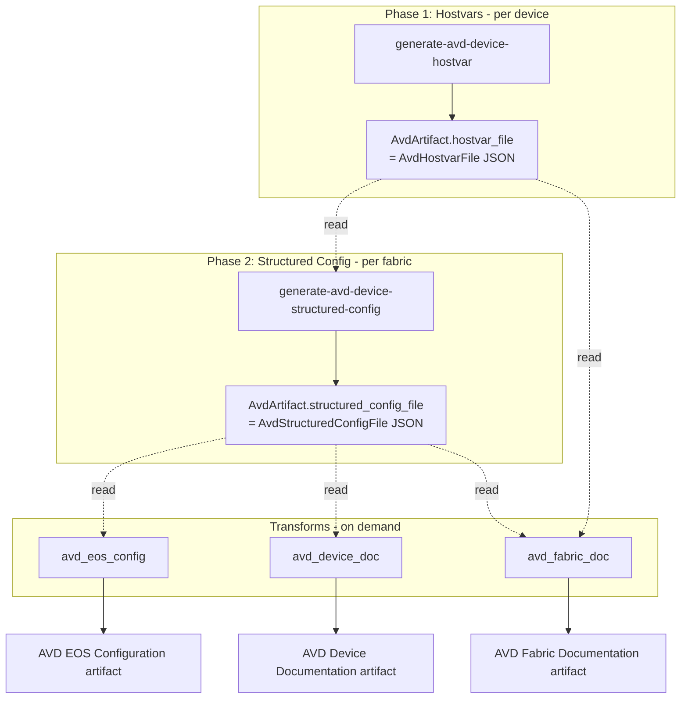

# AVD pipeline overview

:::info Developer Guide
If you want to *use* the system to produce configs, start with [Quick Start](../../quick-start.md).
:::

The Arista Validated Design (AVD) pipeline transforms Infrahub's network data model into PyAVD-compatible input data, then renders Arista EOS configurations and human-readable documentation from it.

## PyAVD version

:::warning Version-sensitive
The integration targets **pyavd >= 6.4.0, < 6.5.0** (pinned in [`pyproject.toml`](https://github.com/opsmill/infrahub-arista-avd/blob/main/pyproject.toml)).

The following sections are version-sensitive — review them when upgrading PyAVD:

- [Hostvars Reference](./hostvars.md) — the PyAVD input schema.
- [Role Mapping](./role-mapping.md) — AVD device type names (for example, `l3leaf`, `super-spine`).
- [Transforms](./transforms.md) — the PyAVD functions the transforms call (`validate_inputs`, `get_avd_facts`, `get_device_structured_config`, `get_device_config`, `get_fabric_documentation`).
:::

## The two-phase pipeline

### Phase 1 — Hostvars

**Generator**: [`generate-avd-device-hostvar`](https://github.com/opsmill/infrahub-arista-avd/blob/main/generators/generate_avd_device_hostvar.py)
**Target**: each `DcimDevice` in the `avd_devices` group (one task per device).

For each device the generator:

1. Extracts device attributes — name, role, BGP ASN, node ID, loopback, management IP.
2. Determines the **uplink role** based on the device's role: `spine → super_spine` interfaces, `leaf` and `border_leaf → spine` interfaces, `l2leaf → leaf` interfaces, `super_spine →` no uplinks.
3. Extracts connected endpoints (servers) from interfaces with `role = "server"`, including tagged/untagged VLANs.
4. For leaves, extracts the MLAG peer information, then the virtual router MAC.
5. For leaves and spines, queries EVPN tenants, VRFs, SVIs, and L2 VLANs associated with the fabric (skipped entirely for `l2leaf`).
6. For Border Leafs, evaluates `NetworkLink` objects with `role=dci` in the fabric and emits valid links as profile-free PyAVD `l3_edge.p2p_links` entries. DCI addressing resolves from `NetworkFabric.fabric_ip_pools` role `dci` first, falls back to the legacy `NetworkFabric.dci_pool`, and then uses deterministic Fabric Supernet fallback when the required DCI prefix-pool role is missing.
7. Builds a complete PyAVD `hostvars` dict (see [Hostvars Reference](./hostvars.md)).
8. Serialises to JSON, computes a SHA256 checksum, and compares against the previous content. If changed (or absent), writes a new `AvdHostvarFile` as a child of the device's `AvdArtifact` node.

### Phase 2 — structured config

**Generator**: [`generate-avd-device-structured-config`](https://github.com/opsmill/infrahub-arista-avd/blob/main/generators/generate_avd_device_structured_config.py)
**Target**: each `NetworkFabric` in the `fabrics` group (one task per fabric).

For the fabric the generator:

1. Walks the fabric hierarchy (`fabric → pods → devices`, `fabric → pods → racks → devices`) to collect every device.
2. Verifies each device has a hostvar artifact; fails fast if any is missing (meaning Phase 1 didn't complete for that device).
3. Fetches the hostvars JSON for every device.
4. Calls `pyavd.validate_inputs()` across all hostvars.
5. Calls `pyavd.get_avd_facts()` once for the fabric to derive shared facts (routed-uplink allocations, VLAN assignments, etc.).
6. For each device, calls `pyavd.get_device_structured_config(hostvars, facts)` and gets a dict of structured AVD config.
7. Serialises to JSON, computes a SHA256 checksum, and compares against the previous content. If changed (or absent), writes a new `AvdStructuredConfigFile` as a child of the device's `AvdArtifact`.

### Transforms — on demand

When an operator opens an AVD artifact in the Infrahub UI, the matching transform runs:

- **`avd_eos_config`** — reads `structured_config_file`, calls `pyavd.get_device_config()`, returns `text/plain`.
- **`avd_device_doc`** — reads `structured_config_file`, calls the PyAVD device documentation function, returns `text/markdown`.
- **`avd_fabric_doc`** — reads hostvars and structured configs for all devices in the fabric, calls `pyavd.get_fabric_documentation()`, returns `text/markdown`.

See [Transforms](./transforms.md) for the full transform-by-transform reference.

## Components at a glance

| Generator / Transform | Target | File |
|-----------------------|--------|------|
| `generate-avd-device-hostvar` | per device | [`generators/generate_avd_device_hostvar.py`](https://github.com/opsmill/infrahub-arista-avd/blob/main/generators/generate_avd_device_hostvar.py) |
| `generate-avd-device-structured-config` | per fabric | [`generators/generate_avd_device_structured_config.py`](https://github.com/opsmill/infrahub-arista-avd/blob/main/generators/generate_avd_device_structured_config.py) |
| `avd_eos_config` | per device | [`transforms/avd_eos_config.py`](https://github.com/opsmill/infrahub-arista-avd/blob/main/transforms/avd_eos_config.py) |
| `avd_device_doc` | per device | [`transforms/avd_device_doc.py`](https://github.com/opsmill/infrahub-arista-avd/blob/main/transforms/avd_device_doc.py) |
| `avd_fabric_doc` | per fabric | [`transforms/avd_fabric_doc.py`](https://github.com/opsmill/infrahub-arista-avd/blob/main/transforms/avd_fabric_doc.py) |

## Related pages

- [Hostvars Reference](./hostvars.md) — the exact PyAVD input structure built per role.
- [AvdArtifact & File Storage](./artifacts.md) — schema, relationships, and how Phase 1 and Phase 2 share data.
- [Role Mapping](./role-mapping.md) — Infrahub roles → AVD device types.
- [Transforms](./transforms.md) — detailed transform-by-transform breakdown.
- [Extending the Pipeline](./extending.md) — worked examples for adding roles, transform outputs, or hostvar fields.
- [Debugging the Pipeline](./debugging.md) — object-store inspection, forced regeneration, single-generator re-runs.
