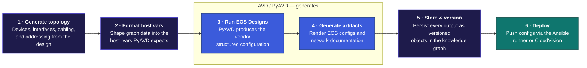

# Arista AVD Reference Design

This reference design models Arista datacenter fabrics in Infrahub and generates EOS device configurations, per-device documentation, and ANTA test catalogs via the AVD pipeline. All changes run through Infrahub's branching and proposed-change workflow.

If you are new to Infrahub, start with the [Infrahub documentation](https://docs.infrahub.app) to understand branches, proposed changes, generators, and artifacts before working through the guides here.

Six stages take a high-level fabric design to versioned, deployable configuration. Infrahub owns the data, orchestration, and version control; PyAVD runs natively inside it to generate the structured configuration and documentation.

## What it's for

- **Generate a complete fabric from a design** — define topology parameters and addressing pools; generators create all super-spines, spines, and leaves, allocate loopback, interconnect, and management addresses, BGP ASNs, and node IDs, and cable devices together automatically.
- **Render EOS device configurations and documentation** — PyAVD runs inside Infrahub workers and produces EOS CLI configurations, per-device and fabric-level Markdown documentation, and a cabling plan CSV as downloadable artifacts.
- **Make incremental day-two changes** — edit the design and regenerate; checksum-based idempotency applies changes only to affected objects; branch-aware pools prevent collisions across parallel work.
- **Give other teams access to network data** — the fabric is queryable through the Infrahub Web UI, GraphQL API, and MCP interface; the Streamlit service portal provides guided workflows for stakeholders without API or CLI access.
- **Track and review every change** — all changes run through Infrahub branches and proposed changes, with a full diff before any change reaches a device.

## How to use it

### Provision a fabric

- Create a NetworkFabric with pods and racks; set device counts and assign addressing pool ranges.
- Run FabricGenerator from the Infrahub UI — PodGenerator and RackGenerator trigger automatically from event rules.
- The generator chain creates all devices, allocates addresses, ASNs, and node IDs, and cables them together.
- Run the AVD generators to produce per-device host_vars and structured configuration.
- Render EOS artifacts through the transforms, or open a proposed change — the CI pipeline renders them for every device at once.

### Operate day-two through the service portal

- Add a network segment — create a VRF, VLAN, and SVI on a target fabric.
- Provision a server into a compute rack.
- Create an EVPN tenant with a VNI base allocation across one or more fabrics.
- Each operation creates a branch and opens a proposed change for review before anything reaches production.

### Query and access through the API and MCP

- **GraphQL API** — query devices, addresses, configurations, and topology programmatically.
- **MCP interface** — AI assistant access to all fabric data.
- **Infrahub Web UI** — searchable, filterable views for stakeholders without Git or Python access.

## Who it's for

- **Network automation teams running AVD with static variable files** — add a source of truth, API and UI layer, and branch-based change control on top of an existing AVD workflow. → [Provision Your First Fabric](./provision-first-fabric.md)
- **Teams evaluating how to operate AVD at scale** — the pipeline derives per-device host_vars from the source of truth; no separate inventory files are required. → [Quick Start](./quick-start.md)
- **Contributors extending the pipeline** — add new device roles, schema fields, or transform outputs; the developer guide covers the full chain, role mapping, and concrete examples. → [Developer Guide](./developer-guide/index.md)

## What's included

- **Schemas** — the source-of-truth definition. Specifies what data Infrahub stores, how it relates, and what generators and transforms can read.
  - Topology: Fabric → Pod → Rack → Device hierarchy
  - IPAM: prefixes and addresses with role tagging (loopback, interconnect, management, server)
  - EVPN: VRFs, SVIs, L2 VLANs; MLAG: domain and peer pool definitions
  - AVD types: `AvdArtifact` for per-device host_var and structured-config tracking with checksums
- **Generators** — the automation layer. Define topology parameters and pool ranges; generators derive the full fabric from that design intent. All are checksum-based and idempotent.
  - FabricGenerator, PodGenerator, RackGenerator — create devices, allocate addresses, assign BGP ASNs and node IDs, cable devices together
  - GenerateAVDDeviceHostvar — assembles per-device PyAVD input from the source of truth
  - AvdDeviceStructuredConfigGenerator — runs PyAVD to produce structured configuration
  - GenerateServerCabling — handles server attachment
- **Transforms** — the rendering layer. Reads structured data from generators and outputs downloadable artifacts. PyAVD runs inside Infrahub workers.
  - EOS device configurations
  - Per-device and fabric-level Markdown documentation
  - Cabling plan CSV
  - ANTA test catalogs (generation is included; test execution on the roadmap)
  - Computed interface descriptions
- **Seed data** — a ready-to-run starting point. `invoke load` populates Infrahub immediately with the manufacturer, cEOS-LAB device type, device profiles and templates, addressing and number pools, and the `OTTERNET_FABRIC` design with its pod, racks, switches, tenants and VRFs.
- **Service portal** — a Streamlit application for self-service day-2 operations. Every operation creates a branch and opens a proposed change for review.
  - Add a network segment (VRF, VLAN, SVI)
  - Provision a server into a rack
  - Create an EVPN tenant
  - Fabric Design visualization (topology, cabling, settings, EVPN tenants)
- **Stack** — Docker Compose bundling everything needed to run locally: Infrahub with PyAVD, the service portal, a bundled Ansible runner for device deployment, and Neo4j.

## Best practices

- **Work on branches.** Create a named branch for each change set. The generator chain and service portal both operate on branches; proposed changes give you a diff before anything merges.
- **Run `invoke load` in order.** The load sequence is ordered: schemas, then menu, then seed data, then repository registration, then triggers. Running steps out of order or skipping `uv sync` first is the most common cause of load failures.
- **Re-run generators idempotently.** All generators use checksum-based change detection — re-running after a partial failure is safe and applies only what changed.
- **Use the service portal for repeatable day-two operations.** The portal wraps generator calls and branch creation into guided workflows with validation. For one-off changes, the Infrahub UI and GraphQL API work directly; use the portal for provisioning workflows run by team members without API or CLI access.
- **Scope to supported capabilities.** This reference design covers a defined set of AVD capabilities — uncommon or highly custom options may not be modeled. Review the [Supported Capabilities](./supported-capabilities.md) page before planning a deployment.

## Get started

**Prerequisites:** Docker and Docker Compose · uv · Python 3.11+

1. Clone the repository and run `uv sync --all-packages` to install dependencies.
2. Build the custom Infrahub image: `uv run invoke build` (one-time).
3. Start the stack: `uv run invoke start`.
4. Load schemas, seed data, and the repository: `uv run invoke load`.
5. Follow [Provision Your First Fabric](./provision-first-fabric.md) to generate a fabric and reach rendered EOS artifacts.

## Additional resources

| Goal | Guide |
|------|-------|
| Get the stack running | [Quick Start](./quick-start.md) — prerequisites, install steps, and first load |
| Generate your first fabric | [Provision Your First Fabric](./provision-first-fabric.md) — end-to-end walkthrough |
| Check what's supported | [Supported Capabilities](./supported-capabilities.md) — capability matrix |
| Understand how it's built | [Architecture Overview](./developer-guide/architecture.md) — system components and generator pipeline |
| Extend the pipeline | [Extending the Pipeline](./developer-guide/avd/extending.md) — new roles, transforms, schema fields |
| Find solutions to common issues | [Troubleshooting](./troubleshooting.md) |
