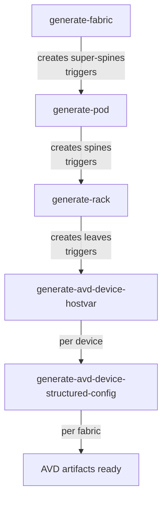

# Provision your first fabric

Prerequisites: [Quick Start](./quick-start.md) complete — Infrahub is running at `http://localhost:8000`, and seed data (fabrics, pods, racks, device types, IP pools) is loaded.

At this point the fabric design is loaded and the seven switches exist with their pinned identity, but they are **not cabled** and have no host_vars. The steps below generate the cabling, host_vars, and configurations for `NFD41_FABRIC`.

## The generator chain

The project ships four generators that must run in a specific sequence. You trigger the first one; each subsequent generator is triggered automatically by the previous one finishing.



| Step | Generator | What it creates |
|------|-----------|-----------------|
| 1 | **generate-fabric** | Super-spine switches using the fabric loopback, VTEP, management, ASN, and node ID pools |
| 2 | **generate-pod** | Spine switches for each pod |
| 3 | **generate-rack** | Leaf switches for each rack |
| 4 | **generate-avd-device-hostvar** | Per-device PyAVD hostvars (stored in the graph as an `AvdHostvarFile`) |
| 5 | **generate-avd-device-structured-config** | Per-device structured AVD config (stored as `AvdStructuredConfigFile`) |

## Step 1 — Create a branch

Do this work on a branch so the changes stay isolated and you can review them as a proposed change before bringing them into `main`. In the Infrahub UI: click the branch selector in the top bar, then **+ Create branch**, and name it something like `generate-fabric-l3ls-multipod-a`.

You can also create a branch from the CLI:

```bash
uv run infrahubctl branch create generate-fabric-l3ls-multipod-a
```

The CLI route needs credentials in your shell — either `source .envrc` first or set `INFRAHUB_USERNAME`/`INFRAHUB_PASSWORD` (or `INFRAHUB_API_TOKEN`). If you take the CLI route, also switch the UI's branch selector to the new branch — subsequent UI actions need to be scoped there.

## Step 2 — Run the fabric generator

1. In the Infrahub UI, open **Actions → Generator definitions** from the main menu.
2. Find **`generate-fabric`** in the list and click it.
3. In the generator page, click the **Run** button.
4. Select the target fabric (`NFD41_FABRIC`) from the dropdown.
5. Click **Run** to start.

Infrahub queues the generator and shows progress. The fabric generator itself takes under a minute.

## Step 3 — Watch the chain run

You don't need to manually trigger the pod, rack, and AVD generators — they are chained via event triggers. In the UI:

1. Open **Actions → Tasks** (or watch the running-task indicator in the navbar).
2. Tasks appear in this order:
   - `generate-fabric` (1 task, per fabric)
   - `generate-pod` (one per pod in the fabric)
   - `generate-rack` (one per rack in the fabric)
   - `generate-avd-device-hostvar` (one per device created — super-spines, spines, leaves)
   - `generate-avd-device-structured-config` (one task for the whole fabric, runs after all hostvars are ready)

The full chain typically takes a few minutes depending on fabric size.

## Step 4 — Verify devices exist

Once all tasks complete, open **Devices → All Devices** in the menu. You should see devices with roles:

- `super_spine` — top of the fabric
- `spine` — one per pod
- `leaf` — one or more per rack

Each device has a BGP ASN, a node ID, a loopback IP, a management IP, and interfaces with IP addresses assigned from the fabric's pools.

## Step 5 — Render the AVD artifacts

The per-device AVD artifacts (EOS configs, device documentation) can be rendered two ways:

- **Manually on the branch**: open any device, switch to the **Artifacts** tab, and click **Regenerate** on each artifact. Fine for spot-checking one device.
- **In a proposed change** (recommended for a full review): open a proposed change from the branch and the pipeline renders artifacts for every device in one step as part of the review.

To open a proposed change:

1. Switch to **Branches** in the menu and select your branch.
2. Click **Create Proposed Change**.
3. Fill in a name and description and submit.

## Step 6 — Verify AVD artifacts are rendered

Open the **Artifacts** tab — either on the proposed change for the full set, or on an individual device — to see:

- **AVD EOS Configuration** — Arista EOS CLI config for the device.
- **AVD Device Documentation** — Markdown documentation for the device.
- **AVD Fabric Documentation** — full fabric markdown documentation.

See [Viewing Artifacts](./viewing-artifacts.md) for how to open and download each artifact.

## Step 7 — Merge the branch (optional)

Once you're happy with the results, bring the branch into `main`. Two options:

- **Merge the proposed change** after review — the standard Git-style flow with diff inspection.
- **Merge the branch directly** — from **Branches → your branch → Merge**, no proposed change needed. Faster but skips the review surface.

You can now move on to day-2 workflows: [Add a Network Segment](./how-to/add-network-segment.md), [Add a Server](./how-to/add-server.md), [Create a Tenant](./how-to/create-tenant.md), or [Regenerate a Fabric](./how-to/regenerate-fabric.md).

## If something goes wrong

The most common failures are documented in [Common Issues](./troubleshooting.md):

- The fabric generator completes but no spines or leaves appear.
- A task hangs in "running" state.
- An artifact shows `no structured config available`.
