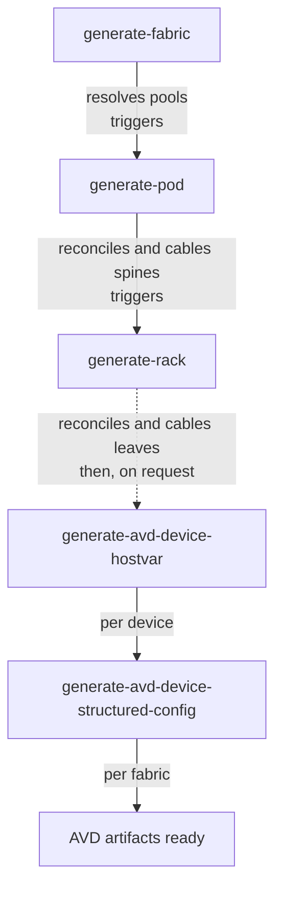

# Provision your first fabric

Prerequisites: [Quick Start](./quick-start.md) complete — Infrahub is running at `http://localhost:8000`, and seed data (`OTTERNET_FABRIC`, its pod and three racks, the seven switches, device types, IP pools) is loaded.

At this point the fabric design is loaded and the seven switches exist with their pinned identity, but they are **not cabled** and have no host_vars. The steps below generate the cabling, host_vars, and configurations for `OTTERNET_FABRIC`.

## The generator chain

The fabric is built by five generators that run in a fixed sequence. You trigger `generate-fabric`; the pod and rack generators follow it automatically through event triggers. The two AVD generators run when something asks for them (see Step 3).


```mermaid
flowchart TD
    A[generate-fabric] -->|resolves pools<br/>triggers| B[generate-pod]
    B -->|reconciles and cables spines<br/>triggers| C[generate-rack]
    C -.->|reconciles and cables leaves<br/>then, on request| D[generate-avd-device-hostvar]
    D -->|per device| E[generate-avd-device-structured-config]
    E -->|per fabric| F[AVD artifacts ready]
```

| Step | Generator | What it creates |
|------|-----------|-----------------|
| 1 | **generate-fabric** | Nothing for `OTTERNET_FABRIC`: it declares no device tier above its spines. The generator resolves the fabric's pools and signals the pod generator |
| 2 | **generate-pod** | The two spines of `otternet-pod1`, reconciled by name, with their interfaces expanded from the spine template |
| 3 | **generate-rack** | The leaves of `K8S_LEAFS`, `APP_LEAFS` and `BORDER_LEAFS`, their uplink cabling to the spines, and the MLAG peer links |
| 4 | **generate-avd-device-hostvar** | Per-device PyAVD hostvars (stored in the graph as an `AvdHostvarFile`) |
| 5 | **generate-avd-device-structured-config** | Per-device structured AVD config (stored as `AvdStructuredConfigFile`) |

## Step 1 — Create a branch

Do this work on a branch so the changes stay isolated and you can review them as a proposed change before bringing them into `main`. In the Infrahub UI: click the branch selector in the top bar, then **+ Create branch**, and name it something like `generate-otternet-fabric`.

You can also create a branch from the CLI:

```bash
uv run infrahubctl branch create generate-otternet-fabric
```

The CLI route needs credentials in your shell — either `source .envrc` first or set `INFRAHUB_USERNAME`/`INFRAHUB_PASSWORD` (or `INFRAHUB_API_TOKEN`). If you take the CLI route, also switch the UI's branch selector to the new branch — subsequent UI actions need to be scoped there.

## Step 2 — Run the fabric generator

1. In the Infrahub UI, open **Actions → Generator definitions** from the main menu.
2. Find **`generate-fabric`** in the list and click it.
3. In the generator page, click the **Run** button.
4. Select the target fabric (`OTTERNET_FABRIC`) from the dropdown.
5. Click **Run** to start.

Infrahub queues the generator and shows progress. The fabric generator itself takes under a minute.

:::warning Run the topology generators once per fresh load
`generate-fabric`, `generate-pod` and `generate-rack` are **not** idempotent against a fabric that is already cabled: `generate-pod` cuts each spine's interfaces down and deletes the leaf-facing ports the racks are cabled to, and `generate-rack` then fails. Run this step only on an instance where the fabric has not been built yet, such as straight after `invoke load`. To refresh the configuration of a fabric that is already built, run only the AVD stage (`uv run invoke avd --branch <branch>`).
:::

The CLI equivalent of Steps 2 and 3, including the AVD stage and artifact regeneration, is:

```bash
uv run invoke avd --topology --branch generate-otternet-fabric
```

## Step 3 — Watch the chain run

You don't need to manually trigger the pod and rack generators — they are chained
via event triggers.

:::note The AVD stage is not chained from the rack generator
`generate-avd-device-hostvar` has no trigger rule at all. It runs when something
asks: `invoke avd`, a manual run from **Actions → Generator definitions**, the
portal's request templates, or a proposed change (it is
`execute_in_proposed_change: true`, which is what makes a service request show
its fabric consequence). `generate-avd-device-structured-config` follows it, both
through its own trigger on `avd_hostvars_ready` and in the proposed-change
pipeline.
:::

In the UI:

1. Open **Actions → Tasks** (or watch the running-task indicator in the navbar).
2. Tasks appear in this order:
   - `generate-fabric` (1 task, per fabric)
   - `generate-pod` (one per pod in the fabric)
   - `generate-rack` (one per rack in the fabric)
   - `generate-avd-device-hostvar` (one per switch, seven in all), when you run it
   - `generate-avd-device-structured-config` (one task for the whole fabric, runs after all hostvars are ready)

The full chain typically takes a few minutes depending on fabric size.

## Step 4 — Verify devices exist

Once all tasks complete, open **Devices → Fabric Switches** in the menu. You should see seven switches:

- `spine` — `spine-otternet-pod1-1` and `spine-otternet-pod1-2`
- `leaf` — `leaf-otternet-pod1-1-1` and `-1-2` (`K8S_LEAFS`), `-2-1` and `-2-2` (`APP_LEAFS`), and `-3-1` (`BORDER_LEAFS`)

Each switch keeps the BGP ASN, node ID, loopback and management address pinned in `objects/26_otternet_devices.yml`, and now has its uplink and MLAG peer interfaces cabled under **Devices → Connections**.

## Step 5 — Render the AVD artifacts

The per-device AVD artifacts (EOS configs, device documentation) can be rendered two ways:

- **Manually on the branch**: open any device, switch to the **Artifacts** tab, and click **Regenerate** on each artifact. Fine for spot-checking one device.
- **In a proposed change** (recommended for a full review): open a proposed change from the branch and the pipeline renders artifacts for every device in one step as part of the review.

To open a proposed change:

1. Switch to **Branches** in the menu and select your branch.
2. Click **Create Proposed Change**.
3. Fill in a name and description and submit.

## Step 6 — Verify AVD artifacts are rendered

Open the **Artifacts** tab — either on the proposed change for the full set, or on an individual device — to see:

- **AVD EOS Configuration** — Arista EOS CLI config for the device.
- **AVD Device Documentation** — Markdown documentation for the device.
- **AVD Fabric Documentation** — full fabric markdown documentation.

See [Viewing Artifacts](./viewing-artifacts.md) for how to open and download each artifact.

## Step 7 — Merge the branch (optional)

Once you're happy with the results, bring the branch into `main`. Two options:

- **Merge the proposed change** after review — the standard Git-style flow with diff inspection.
- **Merge the branch directly** — from **Branches → your branch → Merge**, no proposed change needed. Faster but skips the review surface.

You can now move on to day-2 workflows: [Add a Network Segment](./how-to/add-network-segment.md), [Add a Server](./how-to/add-server.md), [Create a Tenant](./how-to/create-tenant.md), or [Regenerate a Fabric](./how-to/regenerate-fabric.md).

## If something goes wrong

The most common failures are documented in [Common Issues](./troubleshooting.md):

- The fabric generator completes but no spines or leaves appear.
- A task hangs in "running" state.
- An artifact shows `no structured config available`.
